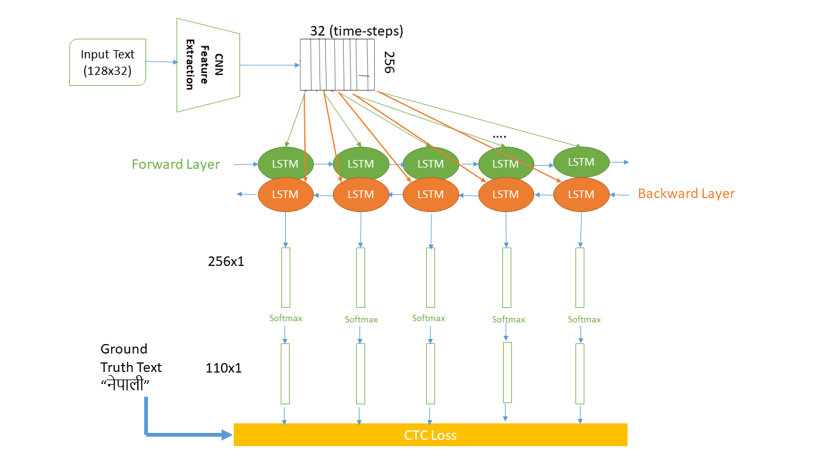
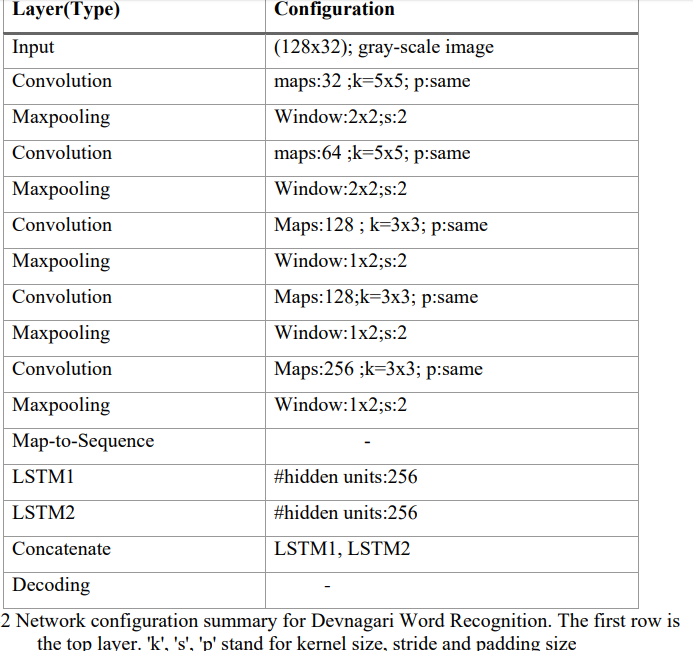

# Handwritten Word Recognition in Hindi
### Overview
This project involves using a Convolutional Recurrent Neural Network (CRNN) to recognize handwritten text in Hindi without the need for pre-segmentation into words or characters. The CRNN model is trained using the Connectionist Temporal Classification (CTC) loss function, which is designed to handle the alignment problem in handwritten text.

## <i> Basic Concept of Operation

* Initially, a Convolutional Recurrent Neural Network is employed to extract crucial features from the handwritten text image.
* The output before the fully connected (FC) layer of the CNN (512x100x8) is passed through a Bidirectional Long Short-Term Memory (BLSTM) layer. This facilitates capturing sequential dependencies and performing time-sequence operations.
* The CTC loss, as introduced by [Alex Graves](https://www.cs.toronto.edu/~graves/icml_2006.pdf) is used to train the BLSTM. This loss effectively addresses the alignment variations present in different handwriting styles. Given the ground truth text and the BLSTM's output, the loss is computed as `-log("gtText")` aiming to minimize the negative maximum likelihood path.
* CTC determines potential paths based on the provided labels.
* During prediction, CTC decoding is employed to interpret the output.
</i>

### Detail Project Workflow

1. The input image, sized 128x32 and in grayscale, is fed into the model with a specified batch size.
2. The image undergoes five CNN layers, extracting 256 feature maps of size 32x1.
3. The extracted feature vectors are then passed through a two-layer LSTM, forming a BLSTM. This captures text dependencies effectively from both directions, resulting in an output of 32x110 (time-steps x number_of_classes).
4. The BLSTM is trained using the CTC loss function, leveraging correct sparse ground truth texts and their corresponding numeric values.
5. CTC decoding is applied to the LSTM's output to decode the text and predict the written content in the digital image.

Note: The number of classes is determined as 110 during the parsing of ground truth text from images, and this information is saved in the model's character list.

The model detail found 


# Requirements
1. Tensorflow 1.8.0
2. Flask
3. Numpy
4. OpenCv 3

#### Dataset Used
The IIT Devnagari Word Dataset is used for training. It can be downloaded from [Devanagiri Dataset (IIIT-HW-Dev)](https://cvit.iiit.ac.in/research/projects/cvit-projects/indic-hw-data).

###### The trained model achieved a Character Error Rate (CER) of 12.988%, and it was trained on the IIT Devnagari Word dataset along with some additional custom-created datasets.

To Train the model from scratch:
```markdown
$ python main.py --train
```
To validate the model:
```markdown
$ python main.py --validate
```
For Prediction:
```markdown
$ python main.py
```

Running the Web Interface with Flask:
```markdown
$ python upload.py
Validation character error rate of saved model: 12.988031%
Python: 3.6.4 |Anaconda, Inc.| (default, Mar 12 2018, 20:20:50) [MSC v.1900 64 bit (AMD64)]
Tensorflow: 1.8.0
Init with stored values from ../model/snapshot-2
Recognized: "होसले"
Probability: 0.7297366
```
